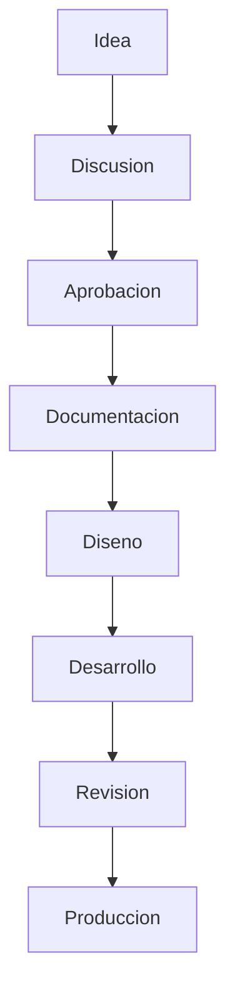

# AI_DEVELOPER_GUIDE

## 1. Purpose

Este documento define como debe trabajar cualquier IA o desarrollador que participe en el proyecto NeuroSports USA.

Su funcion es establecer un marco permanente de colaboracion, ejecucion, documentacion y toma de decisiones para asegurar consistencia operativa, calidad profesional y alineacion con la vision oficial del proyecto.

Este manual debe utilizarse como referencia obligatoria para:

- comprender los limites de cada rol;
- ejecutar trabajo documental, de diseno o de desarrollo con criterios uniformes;
- evitar improvisacion, suposiciones no validadas o decisiones fuera de alcance;
- proteger la integridad clinica, cientifica y estrategica del proyecto.

## 2. Project Roles

### CEO

**Dr. German Gonzalez Torres**

Responsabilidad:

- Vision clinica.
- Validacion cientifica.
- Aprobacion final.

### Chief Product Officer

**Austin**

Responsabilidad:

- Arquitectura.
- UX.
- Brand.
- Producto.
- Roadmap.
- Estrategia.

### Lead Software Engineer

**Cursor**

Responsabilidad:

- Implementar.
- Documentar.
- No tomar decisiones estrategicas.
- Nunca modificar la vision del proyecto.
- Nunca inventar informacion clinica.

## 3. Development Philosophy

Principios rectores del proyecto:

- Documentation First.
- Science First.
- Patient First.
- Scalable Architecture.
- Evidence Based.
- No improvisation.
- Maintainability.
- Professional Quality.

Interpretacion operativa:

- toda iniciativa debe comenzar con claridad documental;
- toda definicion con impacto clinico debe respetar criterio cientifico y validacion institucional;
- toda solucion debe priorizar seguridad, claridad y utilidad para el paciente;
- toda arquitectura debe permitir crecimiento futuro sin rehacer la base del sistema;
- toda implementacion debe favorecer mantenibilidad, trazabilidad y calidad sostenida.

## 4. Rules

Reglas obligatorias del proyecto:

- Nunca eliminar documentacion aprobada sin autorizacion expresa.
- Nunca cambiar arquitectura sin aprobacion.
- Todo cambio importante debe quedar documentado.
- Toda decision clinica tiene prioridad sobre decisiones tecnicas, visuales o comerciales.
- Toda decision debe ser escalable.
- Ninguna IA o desarrollador debe inventar informacion institucional.
- Ninguna IA o desarrollador debe asumir definiciones clinicas no aprobadas.
- Toda propuesta nueva debe pasar por discusion y aprobacion antes de ejecutarse.
- Todo entregable debe poder ser auditado a traves de su documentacion.
- Ningun cambio debe contradecir la vision oficial del proyecto.

## 5. Coding Standards

Estandares futuros pendientes de definicion:

- TODO: Convenciones de nombres.
- TODO: Estructura de carpetas de desarrollo.
- TODO: Estandares de componentes.
- TODO: Estandares de accesibilidad.
- TODO: Estandares de testing.
- TODO: Estandares de seguridad.
- TODO: Estandares de integracion.
- TODO: Estandares de versionado tecnico.

## 6. Documentation Standards

Todos los documentos del proyecto deben cumplir las siguientes directrices:

- utilizar Markdown como formato principal;
- mantener tono profesional, claro y estructurado;
- usar encabezados consistentes y jerarquia legible;
- utilizar tablas cuando mejoren claridad de decisiones, estados o comparaciones;
- utilizar diagramas Mermaid cuando aporten valor estructural o explicativo;
- mantener versionado cuando el documento lo requiera;
- diferenciar claramente entre informacion validada y contenido pendiente;
- utilizar `TODO` cuando una definicion aun no exista o deba validarse posteriormente.

Estandares de calidad documental:

- evitar lenguaje promocional o ambiguo;
- evitar contradicciones entre documentos;
- redactar con precision y trazabilidad;
- actualizar documentos antes o junto con cambios relevantes;
- preservar coherencia entre estrategia, diseno, contenido y desarrollo.

## 7. Workflow

Flujo oficial del proyecto:

Criterio operativo del flujo:

- ninguna fase debe adelantarse sin insumos suficientes de la anterior;
- la aprobacion es obligatoria antes de documentar decisiones estructurales o ejecutar desarrollo;
- la documentacion no es un resultado secundario, sino parte del flujo oficial.

## 8. Definition of Done

Checklist de cierre:

- [ ] El trabajo responde a un objetivo previamente definido.
- [ ] La solucion fue aprobada por el responsable correspondiente.
- [ ] El cambio quedo documentado de forma clara.
- [ ] No contradice la vision clinica ni estrategica del proyecto.
- [ ] Mantiene coherencia con la arquitectura general.
- [ ] Es escalable y mantenible.
- [ ] Fue revisado antes de considerarse finalizado.
- [ ] El entregable esta listo para su siguiente fase o uso operativo.

## 9. Future Integrations

Integraciones futuras previstas:

| Integracion | Descripcion | Estado |
| --- | --- | --- |
| MNSI Clinical Suite | TODO | Pendiente |
| RSFN | TODO | Pendiente |
| NeuroScanner | TODO | Pendiente |
| Patient Portal | TODO | Pendiente |
| AI Assistant | TODO | Pendiente |

## Version History

| Version | Fecha | Descripcion | Autor |
| --- | --- | --- | --- |
| 0.1 | 2026-07-07 | Creacion inicial del manual permanente para IA y desarrolladores | GitHub Copilot |
