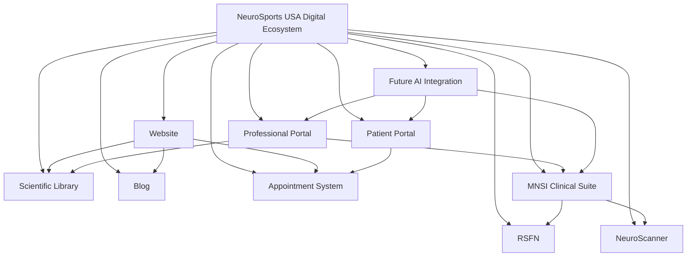
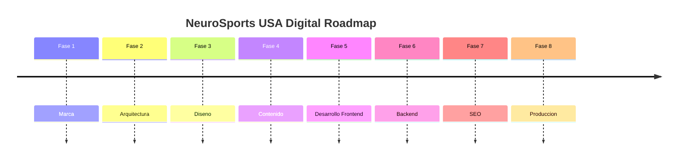

# PROJECT MASTER

## 1. Project Overview

NeuroSports USA Digital es el marco rector para la planificacion, diseno, contenido y desarrollo del ecosistema digital de NeuroSports USA.

Este documento define la base funcional, estrategica y documental del proyecto y actua como fuente oficial de verdad para todas las decisiones relacionadas con marca, experiencia digital, contenido, arquitectura y evolucion del producto.

El proyecto existe para estructurar una presencia digital institucional capaz de:

- presentar a NeuroSports USA con claridad profesional;
- organizar su ecosistema clinico, cientifico y tecnologico;
- facilitar la captacion de pacientes y oportunidades de consulta;
- sostener futuras expansiones funcionales sin rehacer la base del sistema.

Problema que resuelve:

- ausencia o limitacion de una base documental unificada para el desarrollo digital;
- necesidad de alinear marca, objetivos clinicos y producto digital;
- necesidad de construir un sitio y un ecosistema escalable con criterio institucional.

Que representa:

- una referencia de producto de nivel profesional;
- un documento de coordinacion entre negocio, marca, contenido, diseno y desarrollo;
- el punto de control para validar decisiones futuras del proyecto.

## 2. Project Vision

La vision de largo plazo de NeuroSports USA Digital es consolidar una representacion digital institucional robusta, confiable y escalable para una organizacion vinculada al campo de las neurociencias.

La pagina web no se concibe como una presencia institucional basica ni como un activo meramente informativo. Debe funcionar como la representacion digital de una institucion de neurociencias, integrando credibilidad, estructura de conocimiento, servicios, acceso a informacion y capacidad de crecimiento hacia nuevas herramientas digitales.

En terminos estrategicos, el sitio debe evolucionar hasta convertirse en la principal herramienta de captacion de pacientes, apoyo a la relacion con profesionales, distribucion de contenido cientifico y articulacion de futuras capacidades tecnologicas del ecosistema.

## 3. Mission

TODO: Definir la mision institucional oficial.

TODO: Validar redaccion final con direccion institucional.

## 4. Vision Statement

TODO: Definir la vision institucional oficial.

TODO: Validar redaccion final con direccion institucional.

## 5. Core Values

| Valor | Descripcion | Estado |
| --- | --- | --- |
| TODO | TODO | Pendiente |
| TODO | TODO | Pendiente |
| TODO | TODO | Pendiente |
| TODO | TODO | Pendiente |

## 6. Brand Positioning

### Mercado objetivo

TODO: Definir mercado objetivo prioritario y secundario.

### Publico clinico

TODO: Documentar perfiles clinicos prioritarios.

### Publico deportivo

TODO: Documentar perfiles deportivos prioritarios.

### Propuesta de valor

TODO: Definir propuesta de valor institucional y digital.

### Diferenciadores

TODO: Documentar diferenciadores clinicos, cientificos, tecnologicos y de experiencia.

### Competidores

TODO: Identificar competidores directos, indirectos y referentes comparables.

## 7. Business Objectives

| Objetivo | Indicador | Estado | Prioridad |
| --- | --- | --- | --- |
| Consolidar una base documental oficial del proyecto | Documento maestro aprobado | En progreso | Alta |
| Estructurar un ecosistema digital institucional escalable | Arquitectura validada por fases | Pendiente | Alta |
| Convertir el sitio en herramienta principal de captacion de pacientes | Citas y leads generados desde canales digitales | Pendiente | Alta |
| Facilitar el acceso a informacion clinica y cientifica | Consumo de contenido y navegacion por recursos | Pendiente | Media |
| Fortalecer posicionamiento institucional y confianza | Indicadores de conversion, permanencia y autoridad de marca | Pendiente | Alta |

## 8. Digital Ecosystem

## 9. Website Objectives

Objetivos funcionales del sitio:

- generar confianza institucional mediante estructura, claridad y consistencia;
- educar a pacientes, familias, deportistas y profesionales;
- captar pacientes a traves de flujos claros de conversion;
- facilitar la solicitud y gestion inicial de citas;
- posicionar la marca dentro de su categoria institucional y clinica;
- servir como base de integracion para futuros sistemas y modulos.

## 10. Target Audience

### Padres de familia

- Necesidades: comprension clara, confianza clinica, orientacion sobre evaluacion y tratamiento.
- Motivaciones: seguridad, respaldo profesional, acompanamiento.
- Estado: TODO validar con estrategia de marca.

### Adultos

- Necesidades: informacion clara, acceso a servicios, facilidad de contacto.
- Motivaciones: bienestar, diagnostico, tratamiento, confianza.
- Estado: TODO validar con estrategia de captacion.

### Adultos mayores

- Necesidades: claridad, accesibilidad, lenguaje comprensible, soporte en agendamiento.
- Motivaciones: atencion profesional, seguimiento, confianza institucional.
- Estado: TODO validar con criterios de accesibilidad y contenido.

### Deportistas

- Necesidades: evaluacion, rendimiento, recuperacion, soporte especializado.
- Motivaciones: retorno seguro a actividad, optimizacion, prevencion.
- Estado: TODO validar con linea deportiva.

### Entrenadores

- Necesidades: recursos de apoyo, comprension de riesgos, colaboracion profesional.
- Motivaciones: cuidado del atleta, toma de decisiones informada.
- Estado: TODO validar con propuesta educativa.

### Profesionales de la salud

- Necesidades: credibilidad cientifica, acceso a recursos, colaboracion institucional.
- Motivaciones: referencia, actualizacion, trabajo interdisciplinario.
- Estado: TODO validar con estrategia profesional.

### Instituciones educativas

- Necesidades: informacion confiable, posibles programas, orientacion especializada.
- Motivaciones: cuidado de estudiantes, prevencion, soporte profesional.
- Estado: TODO validar con enfoque institucional.

### Clubes deportivos

- Necesidades: soluciones estructuradas para evaluacion, seguimiento y prevencion.
- Motivaciones: rendimiento, seguridad, respaldo especializado.
- Estado: TODO validar con modelo comercial.

## 11. Success Metrics

| KPI | Definicion | Estado |
| --- | --- | --- |
| Numero de citas | Total de citas originadas desde el ecosistema digital | Pendiente |
| Tiempo promedio en pagina | Tiempo medio de permanencia por sesion | Pendiente |
| Conversion | Porcentaje de usuarios que completan accion objetivo | Pendiente |
| Leads | Total de contactos calificados generados | Pendiente |
| SEO | Visibilidad organica, rankings y trafico relevante | Pendiente |
| Pacientes nuevos | Total de nuevos pacientes provenientes de canales digitales | Pendiente |

## 12. Project Roadmap

## 13. Project Rules

- No improvisar.
- Todo debe documentarse.
- Las decisiones clinicas prevalecen sobre las decisiones de diseno.
- La evidencia cientifica tendra prioridad.
- Todo el contenido sera bilingue.
- El proyecto debera ser escalable.
- Ningun cambio estructural debe ejecutarse sin trazabilidad documental.
- Toda definicion de contenido institucional debe validarse antes de publicarse.

## 14. Version History

| Version | Fecha | Descripcion | Autor |
| --- | --- | --- | --- |
| 0.1 | 2026-07-07 | Creacion inicial del documento maestro y su estructura base | GitHub Copilot |
