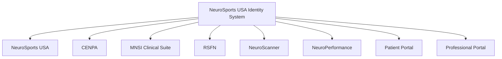

# NeuroSports USA Art Direction

---

## 1. Brand Personality

Matriz preparada para documentar los atributos visuales y perceptuales que debera expresar la identidad institucional.

| Atributo | Descripcion | Justificacion | Estado |
| --- | --- | --- | --- |
| Ciencia | TODO | TODO | Pendiente |
| Tecnologia | TODO | TODO | Pendiente |
| Humanidad | TODO | TODO | Pendiente |
| Innovacion | TODO | TODO | Pendiente |
| Precision | TODO | TODO | Pendiente |
| Elegancia | TODO | TODO | Pendiente |
| Alto desempeno | TODO | TODO | Pendiente |
| Confianza | TODO | TODO | Pendiente |
| Sofisticacion | TODO | TODO | Pendiente |
| Cercania | TODO | TODO | Pendiente |

Notas:

- esta matriz debera utilizarse para validar futuras decisiones de identidad;
- cada atributo requerira justificacion institucional antes de traducirse a recursos visuales.

---

## 2. Brand Positioning

Estructura preparada para documentar como debe percibirse NeuroSports USA en distintos contextos y audiencias.

### Estados Unidos

- TODO: Definir percepcion deseada en el contexto estadounidense.

### Latinoamerica

- TODO: Definir percepcion deseada en el contexto latinoamericano.

### Comunidad cientifica

- TODO: Definir percepcion deseada dentro de la comunidad cientifica.

### Pacientes

- TODO: Definir percepcion deseada para pacientes.

### Familias

- TODO: Definir percepcion deseada para familias.

### Deportistas

- TODO: Definir percepcion deseada para deportistas.

### Medicos remitentes

- TODO: Definir percepcion deseada para medicos remitentes.

---

## 3. Emotional Experience

Matriz preparada para registrar las emociones que la identidad debera activar durante la navegacion.

| Momento | Emocion esperada | Objetivo perceptual | Estado |
| --- | --- | --- | --- |
| Primer contacto | TODO | TODO | Pendiente |
| Exploracion | TODO | TODO | Pendiente |
| Confianza | TODO | TODO | Pendiente |
| Comprension | TODO | TODO | Pendiente |
| Decision | TODO | TODO | Pendiente |
| Seguimiento | TODO | TODO | Pendiente |

---

## 4. Visual Principles

Espacio preparado para definir principios visuales rectores de la identidad.

| Principio | Descripcion | Aplicacion esperada | Estado |
| --- | --- | --- | --- |
| Minimalismo | TODO | TODO | Pendiente |
| Jerarquia | TODO | TODO | Pendiente |
| Respiracion visual | TODO | TODO | Pendiente |
| Espacios amplios | TODO | TODO | Pendiente |
| Diseno premium | TODO | TODO | Pendiente |
| Precision cientifica | TODO | TODO | Pendiente |
| No saturacion | TODO | TODO | Pendiente |

Notas:

- estos principios deberan orientar todas las decisiones de logotipo, interfaz, sistemas y piezas institucionales;
- no deben definirse como preferencias esteticas aisladas, sino como reglas de sistema.

---

## 5. Photography Style

Estructura preparada para documentar la direccion fotografica institucional.

| Dimension | Definicion futura | Estado |
| --- | --- | --- |
| Tipo de fotografia | TODO | Pendiente |
| Iluminacion | TODO | Pendiente |
| Encuadres | TODO | Pendiente |
| Expresiones | TODO | Pendiente |
| Pacientes | TODO | Pendiente |
| Profesionales | TODO | Pendiente |
| Tecnologia | TODO | Pendiente |
| Instalaciones | TODO | Pendiente |

Notas:

- no seleccionar imagenes en esta fase;
- toda direccion futura debera mantener coherencia institucional y funcional.

---

## 6. Brain Visual Language

Espacio preparado para definir como sera representado el cerebro dentro del sistema de identidad institucional.

Aspectos a documentar posteriormente:

- TODO: Nivel de abstraccion o realismo.
- TODO: Rol institucional del cerebro dentro del sistema visual.
- TODO: Criterios de uso en digital, editorial y software.
- TODO: Relacion con ciencia, tecnologia y humanidad.
- TODO: Reglas de consistencia para futuras representaciones.

Notas:

- esta seccion no debe resolver aun el diseno;
- su funcion es preparar los criterios de direccion para futuras ejecuciones visuales.

---

## 7. Color Philosophy

Espacio preparado para documentar posteriormente la filosofia cromatica institucional.

| Categoria | Definicion futura | Estado |
| --- | --- | --- |
| Color primario | TODO | Pendiente |
| Color secundario | TODO | Pendiente |
| Neutros | TODO | Pendiente |
| Colores funcionales | TODO | Pendiente |

Notas:

- no seleccionar colores en esta fase;
- la futura paleta debera justificarse desde identidad, legibilidad, sistema y contexto institucional.

---

## 8. Typography Philosophy

Estructura preparada para documentar la filosofia tipografica institucional.

Aspectos a definir:

- TODO: Rol de la tipografia principal.
- TODO: Rol de la tipografia secundaria.
- TODO: Criterios de legibilidad y jerarquia.
- TODO: Relacion entre sofisticacion, ciencia y claridad.
- TODO: Uso tipografico en web, software y documentos institucionales.

---

## 9. Iconography

Estructura preparada para documentar el sistema iconografico institucional.

Aspectos a definir:

- TODO: Nivel de detalle.
- TODO: Geometria general.
- TODO: Criterios de consistencia.
- TODO: Uso funcional frente a uso expresivo.
- TODO: Relacion con interfaces, documentos y productos digitales.

---

## 10. UI Philosophy

Estructura preparada para definir principios del sistema de interfaz.

| Elemento | Criterio futuro | Estado |
| --- | --- | --- |
| Botones | TODO | Pendiente |
| Cards | TODO | Pendiente |
| Inputs | TODO | Pendiente |
| Spacing | TODO | Pendiente |
| Layouts | TODO | Pendiente |
| Responsive | TODO | Pendiente |

Notas:

- esta seccion no diseña interfaces en esta fase;
- su objetivo es dejar preparada la logica que guiara componentes y experiencias futuras.

---

## 11. Identity Ecosystem

Diagrama preparado para mostrar como la direccion de arte sera aplicada a traves del ecosistema institucional.

Notas:

- el sistema debera permitir coherencia entre marcas, productos y plataformas;
- las reglas futuras deberan distinguir entre identidad madre, submarcas y productos funcionales.

---

## 12. Version History

| Version | Fecha | Descripcion | Autor |
| --- | --- | --- | --- |
| 0.1 | 2026-07-07 | Creacion inicial del documento maestro de direccion de arte | GitHub Copilot |
