# INFORMATION ARCHITECTURE

## 1. Purpose

Este documento define la arquitectura de informacion del sitio web de NeuroSports USA.

Su objetivo es establecer la estructura completa del sitio antes de cualquier decision visual o de desarrollo, asegurando consistencia, escalabilidad y claridad en la organizacion de navegacion, secciones, relaciones internas y crecimiento futuro.

Este documento describe exclusivamente arquitectura del sitio. No define interfaces, contenidos editoriales, estilo visual ni decisiones tecnicas de implementacion.

## 2. Architecture Principles

Principios rectores de la arquitectura:

- claridad estructural;
- navegacion intuitiva;
- escalabilidad futura;
- separacion clara entre audiencias, servicios y recursos;
- facilidad para incorporar nuevos modulos sin rehacer la estructura base;
- coherencia institucional entre informacion clinica, tecnologica y cientifica.

## 3. Primary Navigation

Navegacion principal propuesta:

- Home
- About Us
- Services
- Patients
- Conditions
- Technology
- Research
- Blog
- Contact
- Appointments

## 4. Secondary Navigation

Navegacion secundaria propuesta:

- Patient Portal
- Professional Portal
- Scientific Publications
- Educational Resources
- Clinical Cases
- Contact
- Appointments

Notas:

- `Patient Portal` y `Professional Portal` permanecen como placeholders estructurales.
- La navegacion secundaria puede evolucionar a utilidades superiores, accesos persistentes o nodos de ecosistema.

## 5. Sitemap Structure

### Home

- Home

### About Us

- About Us
- Nuestra historia
- Nuestra filosofia
- Nuestro equipo
- Nuestra metodologia

### Services

- Services
- Clinical Neuropsychology
- Neuropsychological Assessment
- Brain Rehabilitation
- Learning Disorders
- ADHD
- Autism
- Memory
- Executive Functions
- Language
- Sports NeuroPerformance
- Neuromodulation

### Patients

- Patients
- Children
- Adolescents
- Adults
- Older Adults
- Athletes

### Conditions

- Conditions
- TODO: Placeholder for future condition page
- TODO: Placeholder for future condition page
- TODO: Placeholder for future condition page
- TODO: Placeholder for future condition page

### Technology

- Technology
- Neuromodulation
- Digital Rehabilitation
- MNSI
- RSFN
- NeuroScanner

### Research

- Research
- Scientific Publications
- Clinical Cases
- Educational Resources

### Blog

- Blog

### Contact

- Contact

### Appointments

- Appointments

### Patient Portal

- Patient Portal
- TODO: Placeholder for future portal architecture

### Professional Portal

- Professional Portal
- TODO: Placeholder for future portal architecture

## 6. Sitemap Diagram

```mermaid
flowchart TD
    A[Home] --> B[About Us]
    A --> C[Services]
    A --> D[Patients]
    A --> E[Conditions]
    A --> F[Technology]
    A --> G[Research]
    A --> H[Blog]
    A --> I[Contact]
    A --> J[Appointments]
    A --> K[Patient Portal]
    A --> L[Professional Portal]

    B --> B1[Nuestra historia]
    B --> B2[Nuestra filosofia]
    B --> B3[Nuestro equipo]
    B --> B4[Nuestra metodologia]

    C --> C1[Clinical Neuropsychology]
    C --> C2[Neuropsychological Assessment]
    C --> C3[Brain Rehabilitation]
    C --> C4[Learning Disorders]
    C --> C5[ADHD]
    C --> C6[Autism]
    C --> C7[Memory]
    C --> C8[Executive Functions]
    C --> C9[Language]
    C --> C10[Sports NeuroPerformance]
    C --> C11[Neuromodulation]

    D --> D1[Children]
    D --> D2[Adolescents]
    D --> D3[Adults]
    D --> D4[Older Adults]
    D --> D5[Athletes]

    E --> E1[TODO Condition Placeholder]
    E --> E2[TODO Condition Placeholder]
    E --> E3[TODO Condition Placeholder]
    E --> E4[TODO Condition Placeholder]

    F --> F1[Neuromodulation]
    F --> F2[Digital Rehabilitation]
    F --> F3[MNSI]
    F --> F4[RSFN]
    F --> F5[NeuroScanner]

    G --> G1[Scientific Publications]
    G --> G2[Clinical Cases]
    G --> G3[Educational Resources]

    K --> K1[TODO Portal Structure]
    L --> L1[TODO Portal Structure]
```

## 7. Cross-Linking Strategy

Posibles enlaces cruzados estructurales:

- Services <-> Patients
- Services <-> Technology
- Services <-> Conditions
- Research <-> Technology
- Research <-> Blog
- About Us <-> Research
- Patients <-> Appointments
- Contact <-> Appointments
- Patient Portal <-> Appointments
- Professional Portal <-> Research

Criterios de uso:

- conectar servicios con audiencias relevantes;
- conectar tecnologias con servicios relacionados;
- conectar recursos cientificos con autoridad institucional;
- facilitar rutas claras hacia contacto y conversion;
- evitar duplicacion estructural innecesaria.

## 8. Navigation Logic

### Main Navigation Logic

La navegacion principal debe agrupar las secciones estructurales de mayor jerarquia del sitio.

Criterios:

- acceso directo a secciones institucionales, clinicas y de conversion;
- equilibrio entre descubrimiento, educacion y accion;
- estructura preparada para crecimiento de contenido sin alterar la taxonomia principal.

### Secondary Navigation Logic

La navegacion secundaria debe soportar accesos funcionales, recursos recurrentes y modulos especializados.

Criterios:

- visibilidad de accesos de alto valor operativo;
- soporte a usuarios recurrentes o especializados;
- flexibilidad para evolucionar hacia ecosistema digital ampliado.

## 9. Future Scalability

Capacidades previstas de escalabilidad:

- ampliacion de la seccion Conditions con taxonomia clinica validada posteriormente;
- expansion de Services mediante nuevas lineas o subespecialidades;
- evolucion de Technology hacia modulos explicativos o integraciones especificas;
- crecimiento de Research como biblioteca institucional;
- desarrollo posterior de Patient Portal y Professional Portal como productos independientes dentro del ecosistema;
- integracion futura con herramientas, sistemas o modulos aun no definidos en detalle.

Elementos reservados para crecimiento futuro:

- TODO: taxonomia detallada de condiciones;
- TODO: estructura interna de portales;
- TODO: patrones de filtrado o clasificacion de recursos;
- TODO: futuras secciones derivadas del ecosistema clinico y cientifico.

## 10. Governance Notes

Reglas para evolucionar esta arquitectura:

- no agregar secciones nuevas sin justificacion documental;
- toda ampliacion debe respetar la jerarquia principal del sitemap;
- toda nueva pagina debe responder a una funcion institucional, educativa o operativa clara;
- los placeholders solo deben reemplazarse cuando exista aprobacion correspondiente;
- la arquitectura debe mantenerse consistente con la evolucion general del proyecto.

## Version History

| Version | Fecha | Descripcion | Autor |
| --- | --- | --- | --- |
| 0.1 | 2026-07-07 | Creacion inicial de la arquitectura de informacion del sitio web | GitHub Copilot |
